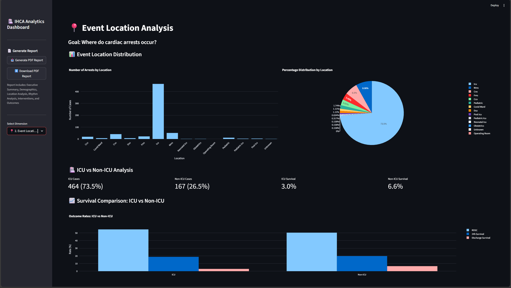

# IHCA Analytics Dashboard



A comprehensive analytics dashboard for In-Hospital Cardiac Arrest (IHCA) data analysis. This project provides interactive visualizations, statistical analysis, and PDF report generation for cardiac arrest cases in hospital settings.

## Project Overview

This project analyzes in-hospital cardiac arrest data through multiple dimensions including demographics, event locations, initial rhythms, interventions, outcomes, temporal patterns, correlations, and rare events. The dashboard is built with Streamlit and provides both interactive visualizations and downloadable PDF reports.

## Files Description

### 📊 **dashboard.py**
The main Streamlit application file that provides an interactive web-based dashboard for analyzing IHCA data.

**Features:**
- 8 analytical dimensions covering all aspects of cardiac arrest cases
- Interactive visualizations using Plotly
- PDF report generation capability
- Sidebar navigation for easy access to different analyses
- Cached data loading for optimal performance

**Key Sections:**
1. **Overview** - Executive summary with key metrics
2. **Population Demographics** - Age, gender, and comorbidity analysis
3. **Event Location** - Location distribution and ICU vs non-ICU analysis
4. **Initial Rhythm** - Rhythm type distribution and shockable vs non-shockable analysis
5. **Interventions** - Shock analysis, CPR duration, and delay analysis
6. **Outcomes** - ROSC, 24h survival, and discharge survival rates
7. **Temporal Patterns** - CPR duration and arrest-to-CPR delay patterns
8. **Correlation Analysis** - Feature correlations with outcomes
9. **Rare Events** - Analysis of rare locations, rhythms, and events

**Usage:**
```bash
streamlit run dashboard.py
```

---

### 📄 **requirements.txt**
Contains all Python package dependencies required to run the dashboard.

**Dependencies:**
- `streamlit` - Web framework for building the dashboard
- `plotly` - Interactive visualization library
- `pandas` - Data manipulation and analysis
- `openpyxl` - Excel file support
- `scipy` - Statistical analysis
- `reportlab` - PDF generation
- `Pillow` - Image processing (required by reportlab)

**Installation:**
```bash
pip install -r requirements.txt
```

---

### 📊 **ihca_encoded.csv**
The processed and encoded dataset containing all IHCA cases used for analysis.

**Encoding Strategies:**
- **Binary Yes/No**: Comorbidities and outcomes (Y=1, N=0, U=-1)
- **Gender**: Male=1, Female=0
- **Smoking**: Yes=1, No=0, Unknown=-1
- **Shockable Rhythm**: VF/VT=1, Other=0
- **Rhythm Dummies**: One-hot encoded rhythm types
- **Location Dummies**: One-hot encoded event locations
- **Duration Columns**: CPR duration and arrest-to-CPR delay in minutes

**Key Columns:**
- Demographics: age, gender, smoking
- Comorbidities: coronary_artery_disease, heart_failure, heart_disease, hypertension, copd, diabetes, cancer, covid_on_admission
- Interventions: shock_count, max_energy, shockable_rhythm, cpr_duration_min, arrest_to_cpr_min
- Outcomes: rosc, survival_24h, survival_to_discharge
- Rhythms: rhythm_AF, rhythm_Asystole, rhythm_Bradycardia, rhythm_PEA, rhythm_Sinus/Other, rhythm_VF, rhythm_VT, rhythm_nan
- Locations: loc_CCU, loc_COVID_WARD, loc_CVU, loc_DSU, loc_FMS, loc_ICU, loc_MMS, loc_NEONATAL_ICU, loc_OBSTETRICS, loc_OPERATING_ROOM, loc_PEDIATRIC, loc_PEDIATRIC_ICU, loc_POST_ICU, loc_UNKNOWN

---

### 📓 **IHCA_DATA_CLEANING_V1.ipynb**
Jupyter notebook containing data cleaning and preprocessing steps.

**Purpose:**
- Initial data exploration and cleaning
- Handling missing values
- Data type conversions
- Outlier detection and removal
- Data validation and quality checks

**Output:** Cleaned dataset saved as `ihca_cleaned.xlsx`

---

### 📓 **IHCA_ENCODED.ipynb**
Jupyter notebook containing data encoding and feature engineering steps.

**Purpose:**
- Encoding categorical variables
- Creating dummy variables for rhythms and locations
- Feature engineering for analysis
- Data transformation for machine learning readiness

**Output:** Encoded dataset saved as `ihca_encoded.csv`

---

### 📊 **ihca_cleaned.xlsx**
Excel file containing the cleaned IHCA data after initial preprocessing.

**Format:** Excel workbook with cleaned data
**Usage:** Intermediate data file used in the encoding process

---

### 📊 **IHCA data 00.xlsx**
Original raw dataset containing in-hospital cardiac arrest cases.

**Format:** Excel workbook with raw data
**Usage:** Source data file used for initial data cleaning

---

### 📄 **IHCA EDA Report.html**
HTML report containing exploratory data analysis (EDA) results.

**Purpose:**
- Initial data exploration findings
- Statistical summaries
- Data quality assessments
- Initial insights and observations

**Usage:** View in web browser for initial data exploration results

---

### 📁 **.gitignore**
Git ignore file specifying files and directories to exclude from version control.

**Ignored Items:**
- Virtual environment (`.venv/`)
- Python cache files (`__pycache__/`)
- Environment files (`.env*`)
- System files (`.DS_Store`)

---

## Project Structure

```
IHCA/
│
├── dashboard.py                 # Main Streamlit dashboard application
├── requirements.txt             # Python dependencies
├── ihca_encoded.csv            # Processed and encoded dataset
├── ihca_cleaned.xlsx           # Cleaned dataset
├── IHCA data 00.xlsx           # Original raw dataset
├── IHCA_DATA_CLEANING_V1.ipynb # Data cleaning notebook
├── IHCA_ENCODED.ipynb          # Data encoding notebook
├── IHCA EDA Report.html        # EDA report
├── README.md                   # This file
└── .gitignore                  # Git ignore file
```

## Getting Started

### Prerequisites
- Python 3.7 or higher
- pip package manager

### Installation

1. **Clone or download the project**
   ```bash
   cd IHCA
   ```

2. **Create a virtual environment (recommended)**
   ```bash
   python -m venv .venv
   source .venv/bin/activate  # On Windows: .venv\Scripts\activate
   ```

3. **Install dependencies**
   ```bash
   pip install -r requirements.txt
   ```

4. **Run the dashboard**
   ```bash
   streamlit run dashboard.py
   ```

5. **Access the dashboard**
   - Open your browser and navigate to `http://localhost:8501`
   - The dashboard will automatically load the data from `ihca_encoded.csv`

## Features

### Interactive Dashboard
- **8 Analytical Dimensions** - Comprehensive analysis across all aspects of IHCA cases
- **Interactive Visualizations** - Plotly charts with zoom, pan, and hover capabilities
- **Statistical Summaries** - Key metrics and statistics for each dimension
- **Real-time Filtering** - Explore data through different dimensions

### PDF Report Generation
- **Comprehensive Reports** - Generate detailed PDF reports with all analytics
- **Executive Summary** - Key metrics and insights
- **Statistical Tables** - Formatted tables with all relevant statistics
- **Downloadable** - Save reports for offline viewing and sharing

### Data Analysis
- **Demographics Analysis** - Age, gender, and comorbidity distribution
- **Location Analysis** - Event location distribution and ICU vs non-ICU comparison
- **Rhythm Analysis** - Initial rhythm distribution and shockable vs non-shockable analysis
- **Intervention Analysis** - Shock counts, CPR duration, and delay analysis
- **Outcome Analysis** - ROSC, 24h survival, and discharge survival rates
- **Temporal Analysis** - CPR duration and arrest-to-CPR delay patterns
- **Correlation Analysis** - Feature correlations with outcomes
- **Rare Events Analysis** - Analysis of rare locations, rhythms, and events

## Usage

### Running the Dashboard
1. Start the Streamlit application
2. Navigate through different analytical dimensions using the sidebar
3. Explore interactive visualizations
4. Generate PDF reports using the sidebar download button

### Generating PDF Reports
1. Click "Generate PDF Report" in the sidebar
2. Wait for the report to be generated
3. Click "Download PDF Report" to save the report

### Data Exploration
- Use the sidebar to navigate between different analytical dimensions
- Interact with charts to explore data details
- View statistical summaries and key insights
- Compare different groups and categories

## Notes

- The dashboard automatically loads data from `ihca_encoded.csv`
- Data is cached for optimal performance
- PDF reports are generated on-demand
- All visualizations are interactive and can be exported

## License

This project is for educational and research purposes.

## Contact

For questions or issues, please refer to the project documentation or contact the development team.

# in-hospital-cardiac-arrest-analytics

